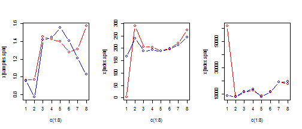
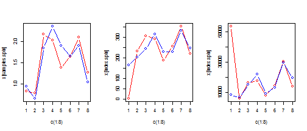
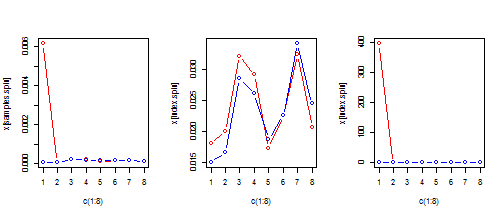
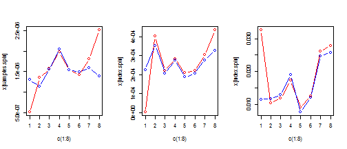

Title Verification
========================================================

Here includes the r script to verify Zhonghao's result of Gln concentration at different time point.

Import data

```r
metabolon = read.csv("D:/Users/tao.xu/Dropbox/Nurse project/data/Metabolon.csv")
id.meta = which(metabolon$BIOCHEMICAL %in% c("glutamine", "creatinine"))
id.001 = grep("001", colnames(metabolon))
metabolon.001 = metabolon[id.meta, id.001]
rownames(metabolon.001) = metabolon$BIOCHEMICAL[id.meta]
samples = sort(colnames(metabolon.001))
samples.spin = samples[1:8]
samples.unspin = samples[9:16]

biocrate.intes = read.csv("D:/Users/tao.xu/Dropbox/Nurse project/data/2013-05-08_Beurteilung_Ints_Urin_Rui_nicht_normalisiert.csv")
biocrate.conc = read.csv("D:/Users/tao.xu/Dropbox/Nurse project/data/2013-05-08_Beurteilung_Count_Urin_Rui_nicht_normalisiert.csv")
biocrate.intes = biocrate.intes[order(biocrate.intes$Sample.Identification), 
    ]
biocrate.conc = biocrate.conc[order(biocrate.conc$Sample.Identification), ]
```


2. Gln original

```r
par(mfcol = c(1, 3))
x = metabolon.001["glutamin", ]
plot(c(1:8), x[samples.spin], type = "b", col = "red", ylim = range(x))
points(c(1:8), x[samples.unspin], type = "b", col = "blue")

index.spin = 4:11
index.unspin = 12:19
x = biocrate.conc$Gln
plot(c(1:8), x[index.spin], type = "b", col = "red", ylim = range(x[4:19]))
points(c(1:8), x[index.unspin], type = "b", col = "blue")

x = biocrate.intes$Gln
plot(c(1:8), x[index.spin], type = "b", col = "red", ylim = range(x[4:19]))
points(c(1:8), x[index.unspin], type = "b", col = "blue")
```

 


2. normalized by metabolon creatinine

```r
par(mfrow = c(1, 3))
y = metabolon.001["creatinine", ]
x = metabolon.001["glutamin", ]
x = x/y
plot(c(1:8), x[samples.spin], type = "b", col = "red", ylim = range(x))
points(c(1:8), x[samples.unspin], type = "b", col = "blue")

x = biocrate.conc$Gln
x[4:19] = x[4:19]/y[c(samples.spin, samples.unspin)]
plot(c(1:8), x[index.spin], type = "b", col = "red", ylim = range(x[4:19]))
points(c(1:8), x[index.unspin], type = "b", col = "blue")

x = biocrate.intes$Gln
x[4:19] = x[4:19]/y[c(samples.spin, samples.unspin)]
plot(c(1:8), x[index.spin], type = "b", col = "red", ylim = range(x[4:19]))
points(c(1:8), x[index.unspin], type = "b", col = "blue")
```

 


3.normalized by biocaretes creatinine concentration

```r
par(mfrow = c(1, 3))
y = biocrate.conc$Creatinine[4:19]
x = metabolon.001["glutamin", ]
x[c(samples.spin, samples.unspin)] = x[c(samples.spin, samples.unspin)]/y
plot(c(1:8), x[samples.spin], type = "b", col = "red", ylim = range(x))
points(c(1:8), x[samples.unspin], type = "b", col = "blue")

x = biocrate.conc$Gln
x[4:19] = x[4:19]/y
plot(c(1:8), x[index.spin], type = "b", col = "red", ylim = range(x[4:19]))
points(c(1:8), x[index.unspin], type = "b", col = "blue")

x = biocrate.intes$Gln
x[4:19] = x[4:19]/y
plot(c(1:8), x[index.spin], type = "b", col = "red", ylim = range(x[4:19]))
points(c(1:8), x[index.unspin], type = "b", col = "blue")
```

 


4.normalized by biocaretes creatinine intensity

```r
par(mfrow = c(1, 3))
y = biocrate.intes$Creatinine[4:19]
x = metabolon.001["glutamin", ]
x[c(samples.spin, samples.unspin)] = x[c(samples.spin, samples.unspin)]/y
plot(c(1:8), x[samples.spin], type = "b", col = "red", ylim = range(x))
points(c(1:8), x[samples.unspin], type = "b", col = "blue")

x = biocrate.conc$Gln
x[4:19] = x[4:19]/y
plot(c(1:8), x[index.spin], type = "b", col = "red", ylim = range(x[4:19]))
points(c(1:8), x[index.unspin], type = "b", col = "blue")

x = biocrate.intes$Gln
x[4:19] = x[4:19]/y
plot(c(1:8), x[index.spin], type = "b", col = "red", ylim = range(x[4:19]))
points(c(1:8), x[index.unspin], type = "b", col = "blue")
```

 


